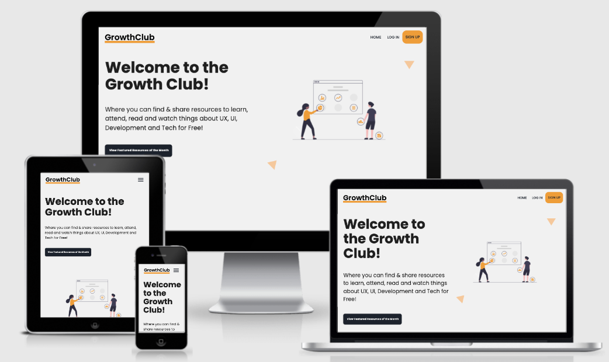
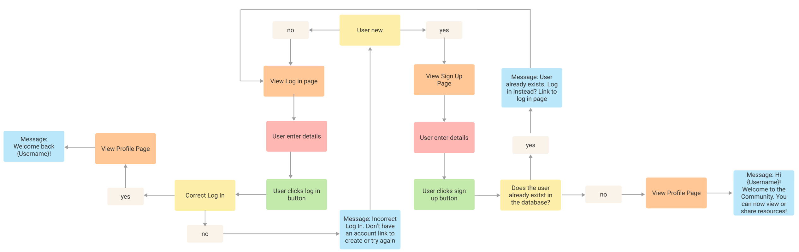
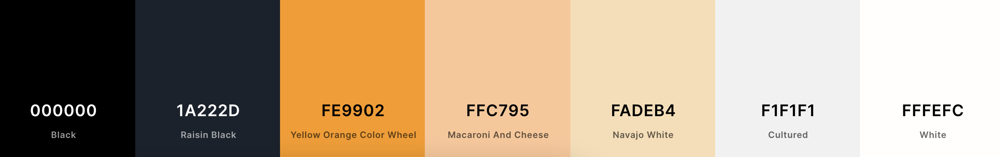

# The Growth Club

This project is part of my Code Institute Full Stack Software Development studies, specifically the Data-Centric Development module. The objective for this milestone project is to "Create a web application that allows users to view and share info on events, tools, articles and videos about UX, Software Development and Tech ", using the CRUD operations of Create, Read, Update, and Delete for info.

[View live version of website via GitHub Pages](https://the-growth-club.herokuapp.com/)


___
<br>

<a></a>
## Table of Contents 
* [UX](#ux)
    * [User Persona](#user-persona)
    * [User Goals](#user-goals) 
    * [Site Owners Goals](#site-owners-goals) 
    * [User Requirements and Expectations](#user-requirements-and-expectations)
        * [Requirements](#requirements)
        * [Expectations](#expectations)
    * [User Stories](#user-stories)
    * [User Flow](#user-flow)
    * [Log In Sign Up Flow](#log-in-sign-up-flow)
* [UI Design](#ui-design) 
    * [Design](#design)
        * [Font](#font)
        * [Colour Scheme](#colour-scheme)
        * [Icons](#icons)
        * [Structure](#structure)
* [Wireframes](#wireframes)
* [Data Structure](#data-structure)
* [Existing Features](#existing-features)
* [Future Features](#future-features)
* [Technologies used](#technologies-used)
    * [Languages](#languages)
    * [Libraries](#libraries)
    * [Tools](#tools)
    * [Design](#design)
* [Testing](#testing)
* [Deployment](#deployment)
* [Credits](#credits)

___
<br>

<a name="ux"></a>
## **UX**
<a></a>
### **User Persona**
This website project will target users who are interested in viewing and sharing information about UX, Design, Software Development and Tech. The priority focus is on providing an easy to navigate and responsive website that allows users to be a part of a community with a collection of resources such as articles, tools, videos and events.

<a></a>
### **User Goals**
- View featured **resources posts per month** created by the Growth Club;
- View **resource posts** created by the Growth Club community;
- View, edit, search, delete **resource posts** created by them;
- The website has to work well on all kinds of devices like mobile phones, tablets and desktops.

<a></a>
### **Site Owners Goals**
- Be the “go-to” place for users in the UX, design, software and tech industry for resources
- To create a community for users in the UX, design, software and tech industry.

<a></a>
### **User Requirements and Expectations**
#### **Requirements**
- Easy to navigate by using the navigation menu.
- Relevant content for each category.
- Appealing visual elements.
- Easy way to find resources relevant to the user.
#### **Expectations**
- When clicking on links (resource and social media links), expect the page to open in a separate browser.
- Expect that the navigation links work properly to take the user where they intended to go.
- Expect to be able to add, edit or delete items added by the user.
- Feedback whether or not registered, logged in, logged out.

<a></a>
### **User Stories**
*Guest User*
1. As a Guest User, I want the main purpose of the site to be clear so that I immediately know what the site is intended for upon entering;
2. As a Guest User, I want to be met with a visually appealing and easy to read layout of created items;
3. As a Guest User, I want to view the featured **resources posts** of the month to get a sense of the value if I sign up as a registered user and they don't have to search for it;
4. As a Guest User, I want to be able to sign-up to create and edit my own **resource posts**;
5. As a Guest User, I want to be able to get in contact via social media if I like the site or have suggestions.

*Registered User*
1. As a Registered User, I want the main purpose of the site to be clear so that I immediately know what the site is intended for upon entering;
2. As a Registered User, I want to be met with a visually appealing and easy to read layout of created items;
3. As a Registered User, I want to view the featured items of the month so that I don't have to search for them;
4. As a Registered User, I want to be able to log back into the Growth Club with my initial latest credentials;
5. As a Registered User, I want to be able to view **resource posts** added by other members of the community;
6. As a Registered User, I want to be able to create, edit and delete the **resource posts** I have added;
7. As a Registered User, I would like to be able to search the site so that I can easily find resources that I am looking for;
8. As a Registered User, I want to be able to bookmark resources I find interesting and remove a bookmark.
9. As a Registered User, I want to be able to change my password on my profile;
10. As a Registered User, I want to be able to delete my account and profile;
11. As a Registered User, I want to be able to log out of my account;
12. As a Registered User, I want to be able to get in contact via social media if I like the site or have suggestions.

*Admin User*
The Admin user the same user stories as the Registered user above with the additional extras below:
1. As an Admin User, I would like the ability to **log in to an admin account** so that I can **create, edit and delete featured resources posts** for each month;
2. As an Admin User, I want to be able to view all **resource posts** added by other members of the community as well as the ability to **edit or delete any resource posts** so that I can **maintain the site to stay updated**

<a></a>
### **User Flow**
In the planning phase, I created a User flow to determine the main paths the user might take on the web app. 


<a></a>
### **Log In Sign Up Flow**
In the planning phase, I created a Login and Sign up/Register flow to determine the main paths the user might take on the web app to manage their status on the website. The success and failure messages differ slightly on the deployed app as the copy was changed during testing with users to be more clear 

___
<br>

<a></a>
## **UI Design**
### **Font**
- I used [Google Fonts](https://fonts.google.com/) to explore the various options.
- The project has the main font of [Roboto](https://fonts.google.com/specimen/Roboto) as it is easy to read and modern
- “Sans-Serif” is used as the default backup font in cases where these fonts have difficulty loading.

<a></a>
### **Colour Scheme**
- The colour scheme is based on creating an environment with energy, excitement and warmth;
- The logo was created with "Raisin Black" and underlined with "Yellow Orange Color Wheel";
- The navbar is created with "Cultured";
- The call to action buttons background is created with "Cultured";
- All colours were checked with WebAIM [https://webaim.org/resources/contrastchecker/](https://webaim.org/resources/contrastchecker/) to check the accessibility of the colours and present a pass.

#### **Colour Palette**
Coolors was used to map out my colour scheme.

- #00000: This colour is used for borders of buttons and where the text needed to stand out more because of the background.
- #1A222D: This colour is used as the main text colour and where the background should completely black like the CTA buttons.
- #FE9902: This colour is used as the primary colour and sets the tone for the website. It is used to show if something is important or show the user where they are.
- #FFC795: This colour is used as a secondary accent colour where something is highlighted.
- #FADEB4: This colour is used as a tertiary accent colour where something is highlighted but should not stand out as much.
- #F1F1F1: This colour is used as an accent colour and mainly used for the landing page background, resource cards, navbar and footer.
- #FFFEFC: This colour is used as the main background colour for the website and for text where elements have darker backgrounds.

<a></a>
### **Icons**
- Majority of icons from the Materialized Icons library was used unless there was not an appropriate icon available then the Font Awesome library is used. 

<a></a>
### **Structure**
The overall structure that was used is the Materialize framework. Materialize provides various elements of CSS and Javascript which is very helpful to keep a good structure on your page.
___
<br>

<a></a>
## **Wireframes**
I have used Balsamic to create low-fidelity wireframes and used Figma to create medium-fidelity wireframes. First I created a basic wireframe for mobile, for tablet and desktop. The website will be easy to navigate by using the navigation bar or by scrolling down the page. I have included a scroll-up button for user convenience. There is a mobile-first focus and therefore I wanted to keep in mind first what will work on mobile.

### **Wireframe Images**
#### **Sketches**
Sketches were part of the first phase of the design for this project. Sketches with pen and paper are used to roughly draft the flow and the structure of the project without having to focus on colour, fonts and the correct layout.
- [Sketch](documentation/wireframes/sketch.png)

#### **Low Fidelity**
[Balsamiq](https://balsamiq.com/) was used to create low-fidelity wireframes. Low-fidelity designs were utilised to make the design process simple and test low-tech concepts. When designing a low-fi prototype, the font types and colours are ignored to focus on the design of the project itself.

*Guest User*
- [Landing Page](documentation/wireframes/guest_user_landing_page.png)
- [Log In Page](documentation/wireframes/guest_user_login_page.png)
- [Registration Page](documentation/wireframes/guest_user_register_page.png)

*Registered User*
- [Landing Page](documentation/wireframes/registered_user_landing_page.png)
- [Profile Page](documentation/wireframes/registered_user_profile_page.png)
- [Resources Page](documentation/wireframes/registered_user_resources_page.png)

*Admin User*
- [Landing Page](documentation/wireframes/admin_user_landing_page.png)
- [Manage Resources Admin Dashboard Page](documentation/wireframes/admin_user_manage_dashboard_page.png)

#### **Medium Fidelity**
[Figma](https://www.figma.com/) was used to create medium-fidelity wireframes. Medium-fidelity designs were utilised to start experimenting with colours, fonts and images.
- [Mobile & Tablet](documentation/wireframes/mobile_design.png)
- [Desktop](documentation/wireframes/desktop_design.png)
___
<br>

<a></a>
## **Data Structure**
A database structure was designed to be specifically suited for The Growth Club. It was important to make sure the nesting relationships between the collections and the keys worked logically. The database was created as a usable non-relational database where data is stored in a consistent and well-organised manner. To maintain a database configuration in a single location where it can be changed easily, ObjectId's are used in several collections to ensure key values are more accurate by using the ObjectId's rather than strings.

[MongoDB](https://www.mongodb.com/) is utilised to store data for The Growth Club. It is a non-relational database-backed Flask web application that allows users to easily create, locate, display, edit and delete data records on the Growth Club web app.

The data structure outline:
[Data Structure](documentation/images/data_structure.png)

### **Collections**
- **Categories collection**
    - This collection holds the category_name key which is a string datatype. 
    - This field data is passed to other collections by utilising the ObjectID rather than the string above.

- **Featured Resources collection**
    - This collection holds several keys for the featured section on the landing page which is only editable by the admin user.
    - The data keys include the category name, resource name, description, date of an event, link to the resource, topic name and a featured image. 
    - All the above keys are strings except for the category name and topic name as the ObjectID's are used from the categories and topics collections respectively. 

- **Resources collection**
    - This collection holds several keys for the resource page where the user can view all the resources in the database.
    - The data keys include the category name, resource name, description, date of an event, link to the resource, topic name and a created by. 
    - All the above keys are strings except for the category name, topic name and created by as the ObjectID's are used from the categories, topics and users collections respectively. 
    - The data from this collection is also used on the user's profile if they have bookmarked a particular resource

- **Topics collection**
    - This collection holds the topic_name key which is a string datatype. 
    - This field data is passed to other collections by utilising the ObjectID rather than the string above.

- **Users collection**
    - This collection holds several keys about the user which is provided by the user on the register page and used again on the log in page.
    - The data keys include the username, email, password and bookmarks. 
    - All the above keys are strings except for the bookmarks key as this is an array datatype. 
    - The bookmarks key is created if the user has bookmarked a resource on the resources page. The resource ObjectID is then used as the value for the item in the array.
___
<br>

<a></a>
## **Existing Features**
- There is a mobile-first focus and therefore I wanted to keep in mind first what will work on mobile.
### Elements on every page
#### Header
1. Logo
- Allows the user to easily recognise the brand of “Growth Club”. If the user clicks on the logo, it will return the users to the “Home” section as they would expect.

2. Navbar
- Navigation Bar - Allows the user to easily navigate the website's sections and find what they are looking for with ease and speed.
- The navigation bar features the Growth Club logo in the top left corner.
- For visitors to the site who are not logged in (*Guest Users*), these menu links are available for them to use:
    - Home
    - Log in
    - Sign Up - This is a CTA and therefore it stands out so that the user is drawn to this button.
- For users who are logged in(*Registered Users*), the list items are as follows:
    - Home
    - Resources
    - Profile 
    - Log out
- Python determines if the user is logged in or not by checking if 'user' in session and passes this data to Jinja to display the correct navbar for the user.
- The navbar is collapsed into a burger icon on small screens.

3. Floating to top button:
- A floating button appears on the lower right of the screen when the user starts to scroll downwards. Clicking this moves the view back up to the top of the page. This feature was added because the resources page can be quite long and the navbar is not fixed to the top of the page.

#### Footer
- The footer features:
 - A brief description of the purpose and mission of the site.
 - Copyright information.
 - Links to social media for Admin -Social Icons - Allows the user to access the social platforms that the designer & creator of the website use.

### Landing Page
- The landing page gives the user an immediate welcome and indication of what the site is about.
- The is a CTA button to view the Featured Resources of the month (Featured Resources section) which was important that they go there if they want to quickly find the most recent resources added by the administrator.
- After the featured section, there is a CTA button to view more resources. If the user is not logged in they will be taken to the login page. If the user is logged in, they will be taken directly to the resources.

#### Featured Section
- On the landing page the featured resources of the month is selected and added by the administrator.
- The purpose is to have one resource for each category each month to be showcased.
- Guest users are also able to view these resources as well as Registered users. 

### Log in Page
- The login page features a simple **form** where the user can enter either their username or their email address and their password.
- There is helper text under each input field to guide the user as to the parameters they can input.
- The user will receive validation or error feedback when they enter information in the input field which is also be accompanied by colours to show validation (green for correct and red for incorrect).
- If the user lands on the log in page but realises they don't have an account yet and would like to register, there is a link on the page that will take them to the registration page or they can click on the navbar menu Sign up button.

### Profile Page 
- Then if the user logs in or register successfully they are taken to their Profile page.
- This page will feature their username at the top to personalise the user experience.
- There are links to take the user to the Resources page or the Featured section on the landing page.
- The user can see all their bookmarked resources on their profile if they have any.
- The user can change their password if they click on the Change password button. A modal will pop up and ask for the new password. If they confirm to change their password, their password will be updated in the database under the Users collection.
- The user can delete their profile if they click on the Delete Profile link. This will open a modal to confirm if they want to continue to delete their profile. If they confirm, their username, email and password will be detailed from the Users collection. They will then be logged out and returned to the landing page as Guest users.

### Resources Page
- Only a Registered user can view the resources page where the registered user can then view, search, add, edit or delete resources. The edit and delete functions will only be available if the user created the resource.
- The user can search by resource description and reset the search box. If there are no results, there will be a message to the user to say there are no results.
- If the user clicks on the "Add a resource" button it will take them to the Add Resource Page.
- If the user created the resource, they will see the edit button for the resource. If the user clicks on the "Edit" button it will take them to the Edit Resource Page.
- If the user created the resource, they will see the delete button for the resource. If the user clicks on the "Delete" button, the resource will be deleted.
- The user can bookmark a resource. If they click on the bookmark icon, this will confirm to them it has been added as a bookmark and appears on their profile.

### Registration & Sign Up Page
- The sign-up page features a simple form, where the user can input a username, email address and password. The form was kept deliberately simple so that signup has minimum barriers.
- If the user lands on the registration page but realises they already have an account and would like to log in, there is a link on the page that will take them to the login page or they can click on the navbar menu Log in Page link. 
- There is a message to the user about not sharing their information to put the user's mind at ease.

### Add Resource Page
- If the user clicked on the Add resource button on the resources page then they will be taken to this page.
- The add resources page features a simple form, where the user can input the basic required information.
- The user will be able to select from the current categories and topics as well as additional information to all the required fields for the resource.
- There is helper text under each input field to guide the user as to the parameters they can input.
- The user will receive validation or error feedback when they enter information in the input field which is also be accompanied by colours to show validation (green for correct and red for incorrect).
- If the user clicks add resource button, it will add the new resource to the database.
- If the user clicks on the cancel button it will take them back to the resources page.

### Edit Resource Page
- The edit resources page features a simple form, where the user can edit only a resource added by them. 
- If the user clicked on the Edit resource button on the resources page then they will be taken to this page. They will only be able to edit the resource if they created the resource.
- The current resource information will be shown and the user can change the information and save it. This will update the database with the new information.
- The user will be able to select from the current categories and topics as well as additional information to all the required fields for the resource.
- There is helper text under each input field to guide the user as to the parameters they can input.
- The user will receive validation or error feedback when they enter information in the input field which is also be accompanied by colours to show validation (green for correct and red for incorrect).
- If the user clicks on the cancel button it will take them back to the resources page.

### Manage Resource Admin Dashboard Page
- This page can only be viewed by the admin user.
- From here the user can manage the featured resources, categories and topics.
- The admin user can add a new featured resource or edit current featured resources. If the admin user clicks on the Add new Featured resources button, then they will be taken to the Add Featured resource page. If the admin user clicks on the edit the resource button, it will take them to the landing page so that they can edit the featured resource form directly from the featured section.
- The admin user can add a new Category if they click on the Add Category button. This will take them to the Add New Category page.
- The admin user can edit current Categories. If the user clicks on the edit button for that category, they will be taken to that edit category page
- The admin user can add a new Topic if they click on the Add Topic button. This will take them to the Add new Topic page.
- The admin user can edit current topics. If the user clicks on the edit button for that topic, they will be taken to the Edit Topic page

#### Add Featured Resource Page (Admin)
- This page can only be viewed by the admin user.
- If the admin user clicked on Add new featured resources button on the Dashboard, then this page will display.
- The add featured resources page features a simple form, where the admin user can input the basic required information. 
- The admin user will be able to select from the current categories and topics as well as additional information to all the required fields for the resource.
- There is helper text under each input field to guide the admin user as to the parameters they can input.
- The admin user will receive validation or error feedback when they enter information in the input field which is also be accompanied by colours to show validation (green for correct and red for incorrect).
- If the admin user clicks add resource featured button, it will add the new resource to the database in the featured resources collection.
- If the user clicks on the cancel button it will take them back to the Manage resources admin dashboard page.

#### Add New Category page
- This page can only be viewed by the admin user.
- If the admin user clicked on Add new category button on the Dashboard, then this page will display.
- The Add New Category page features a simple form, where the admin user can input the basic required information. 
- There is helper text under each input field to guide the admin user as to the parameters they can input.
- The admin user will receive validation or error feedback when they enter information in the input field which is also be accompanied by colours to show validation (green for correct and red for incorrect).
- If the admin user clicks Add Category button, it will add the new category to the database in the Categories collection.
- If the user clicks on the cancel button it will take them back to the Manage resources admin dashboard page.

#### Edit Category page
- This page can only be viewed by the admin user.
- If the admin user clicked on the Edit category button on the Dashboard, then this page will display.
- The current category information will be shown and the admin user can change the information and save it. This will update the database with the new information.
- There is helper text under the input field to guide the user as to the parameters they can input.
- The user will receive validation or error feedback when they enter information in the input field which is also be accompanied by colours to show validation (green for correct and red for incorrect).
- If the admin user clicks the Update Category button, it will update the category in the database for the Categories collection.
- If the user clicks on the cancel button it will take them back to the Manage resources admin dashboard page.

#### Add New Topic page
- This page can only be viewed by the admin user.
- If the admin user clicked on Add new Topic button on the Dashboard, then this page will display.
- The Add New Topic page features a simple form, where the admin user can input the basic required information. 
- There is helper text under each input field to guide the admin user as to the parameters they can input.
- The admin user will receive validation or error feedback when they enter information in the input field which is also be accompanied by colours to show validation (green for correct and red for incorrect).
- If the admin user clicks Add Topic button, it will add the new Topic to the database in the Topics collection.
- If the user clicks on the cancel button it will take them back to the Manage resources admin dashboard page.

#### Edit Topic page
- This page can only be viewed by the admin user.
- If the admin user clicked on the Edit Topic button on the Dashboard, then this page will display.
- The current Topic information will be shown and the admin user can change the information and save it. This will update the database with the new information.
- There is helper text under the input field to guide the user as to the parameters they can input.
- The user will receive validation or error feedback when they enter information in the input field which is also be accompanied by colours to show validation (green for correct and red for incorrect).
- If the admin user clicks the Update Topic button, it will edit the Topic to the database for the Topics collection.
- If the user clicks on the cancel button it will take them back to the Manage resources admin dashboard page.

### Log Out 
- If a registered or admin user clicks on the log out button, they will be logged out of their current session and will no longer be able to see the pages they would if they were logged in.
- A registered user will have to log in again if they want to see their Profile or the Resources Page.
- A Admin user will have to log in again if they want to see their Profile, Resources Page or the Manage Resource Dashboard Page.

### 404 & 500 Page
- The custom 404 & 500 Pages contains an image and text that makes the user understand they have encountered an error. There is a button to return the user to the Growth Club Home page.
___
<br>

<a></a>
## **Future Features**
- Have a 'forgot password' functionality on the log in page.
- Have a more extensive user profile with, profile image, preferences and email to which you can send updates, newsletters etc.
- Events in the form of a calendar to visually represent events and not have it be part of the general resources.
- User can search by category and topic.
- User can filter resources by category or topic.

___
<br>

<a></a>
## **Technologies Used**

### **Languages**
- This project uses HTML, CSS, JavaScript and Python programming languages.

### **Libraries & Frameworks**
- [Materialize](https://materializecss.com/)
    - The project uses **Materialize** to simplify the structure of the website and help make the website responsive easy to do. The majority of the icons used in this project are from the Materlize library.
- [Font Awesome](https://fontawesome.com/)
    - Where the Materialize icon library did not have a usable icon, the fallback icon library used was the Fontawesome for the icons.
- [Google Fonts](https://fonts.google.com/)
    - The project uses **Google fonts** to style the website fonts.
- [Hover.css](https://cdnjs.com/libraries/hover.css/2.1.0)
    - The project uses **Hover.css** to apply hover effects to the projects navbar.
- [Pymongo](https://pypi.org/project/pymongo/) and [Flask-PyMongo](https://flask-pymongo.readthedocs.io/en/latest/) 
    - To connect Python and Flask to the MongoDB database
- [Flask](https://flask.palletsprojects.com/en/2.0.x/) 
    - To construct and render pages.
- [MongoDB Atlas](https://www.mongodb.com/)
    - Non-relational database hosting service used.
- [Werkzeug](https://werkzeug.palletsprojects.com/en/2.0.x/ )
    - A WSGI web application library used for passwords for Python.
- [Jinja](https://jinja.palletsprojects.com/en/3.0.x/)
    - Templating language for Python, to simplify displaying data from the backend of this project smoothly and effectively in HTML.
- [jQuery](https://jquery.com/)
    - JavaScript library

### **Tools**
- [Gitpod](https://www.gitpod.io/)
    - IDE used to build the website
- [Github](https://github.com/)
    - Used to host the repository of all previous versions of the build and linked to Heroku to push the latest changes to the deployed build version held there.
- [Heroku](https://www.heroku.com/)
    - A cloud platform as a service enabling deployment of the site.
- [Responsinator](http://www.responsinator.com/)
    - The project used **Responsinator** to determine if the site was responsive to various devices.
- [Am I Responsive](http://ami.responsivedesign.is/#)
    - The project used **Am I Responsive** to view images of the website on different devices if the site was responsive to various devices.
- Chrome DevTools
    - For this project, the web developer tools built directly into the Google Chrome browser was used to help edit pages and diagnose problems quickly.
- [W3C Markup Validator](https://validator.w3.org/)
    - For testing HTML code
- [W3C CSS Validator](https://jigsaw.w3.org/css-validator/)
    - For testing CSS code
- [JSHint Validator](https://jshint.com/)
    - For detecting errors and potential problems in your JavaScript code
- [Link Checker](https://validator.w3.org/checklink)
    - For checking all links on the website and see if all links work
- Lighthouse in Google dev tool
    - For testing the performance of the website
- [TestProject](https://testproject.io/)
    - For automated testing of website
- [Python Tester](https://extendsclass.com/python-tester.html) 
    - Python code syntax checker
- [Closing Tag Checker for HTML5](https://www.aliciaramirez.com/closing-tags-checker/) 
    - Validates all tags are opening and closing correctly.
- [Google Mobile-Friendly Test Mobile](https://search.google.com/test/mobile-friendly)
    - To check if site is mobiole friendly
- [Grammerly](https://www.grammarly.com/) 
    - To check spelling & grammer
-[AutoPrefixer](https://autoprefixer.github.io/)
    - Autoprefixer to parse CSS and adds vendor prefixes

### **Design**
- [Balsamiq](https://balsamiq.com/)
    - To design low fidelity mockups
- [Figma](https://www.figma.com/)
    - To design a medium-fidelity mockup
___
<br>

<a></a>
## **Testing**
Testing information can be found in the separate [TESTING.md file](documentation/TESTING.md)
___
<br>

<a></a>
## **Deployment**
This project uses GitHub for version control, GitPod as the cloud-based IDE and Heroku to deploy the site into production. The below steps are specific to Gitpod therefore depending on your IDE, you might need to adjust the below steps.

### To clone the project:
From the application's repository, click the "code" button and download the zip of the repository. Alternatively, you can clone the repository using the following line in your terminal: 
```
git clone https://github.com/Franciskadtt/the-growth-club.git
```

The following must be installed on your IDE:
- [PIP](https://pip.pypa.io/en/stable/installing/)
- [Python 3](https://www.python.org/downloads/)

### Database Creation with MongoDB Atlas
You have to create an account with MongoDB. You can see [here](https://docs.atlas.mongodb.com/) how to set up your MongoDB Atlas account. Sign-in or sign-up to MongoDB and create a new cluster then follow the below steps:
1. Go to Collections
2. Go to "+Create Database"
3. Click on "Create Collection"
4. Then add all the collections (see data structure above)
5. Click on "Insert Document"
6. Add key and value - then click "Insert"

### Create the Flask Application
1. Install Flask - type in terminal: 
    ```
    pip3 install Flask
    ```
2. Now we need to create a few new files. First, our Python file that will be the foundation of our application. You can name it something else, in this case, I used app.py, so type in the terminal: 
    ```
    touch app.py
    ```
3. Next, we will be storing some sensitive data, and we need to hide them using environment variables. You can use the terminal or just create a new file. I used the terminal, so type in the terminal:
    ```
    touch env.py
    ```
4. That file should never be pushed to GitHub, so we need to be able to ignore it somehow, so type in the terminal:
    ```
   touch .gitignore
    ```
5. Double check in the gitignore file that you see "env.py" and "pycache/"
6. Go to the env.py file and add the following:
    ```
    import os
 
    os.environ["PORT"] = "5000"
    os.environ["SECRET_KEY"] = "YOUR_SECRET_KEY"
    os.environ["DEBUG"] = "True"
    os.environ["MONGO_URI"] = "YOUR_MONGODB_URI"
    os.environ["MONGO_DBNAME"]= "DATABASE_NAME"
    ```
7. Go to app.py file and import the following:
    ```
    import os
    from flask import (
    Flask, flash, render_template,
    redirect, request, session, url_for)
    from flask_pymongo import PyMongo
    from bson.objectid import ObjectId
    from werkzeug.security import generate_password_hash, check_password_hash
    if os.path.exists("env.py"):
        import env
    ```
8. Create an instance of Flask
    ```
    app = Flask(__name__)
    ```
9. To test your application, tell your app how and where to run your application. Set your IP and PORT environment variables in the hidden env.py file. Make sure to update this to debug=False before the actual deployment of your project.
    ```
    if __name__ == "__main__":
    app.run(host=os.environ.get("IP"),
    port=int(os.environ.get("PORT")),
    debug=True)
    ```
10. You can now run your application, type in the terminal:
    ```
    python3 app.py
    ```

### Deploying to Heroku
1. Setup a Heroku app within the Heroku dashboard with your region (or the closest one to you) and app name.
2. Run pip3 freeze --local > requirements.txt in your workspace terminal to collect any new dependencies.
3. Run python app.py > Procfile to create a Procfile required for Heroku deployment.
4. In Heroku, in your app, select the 'deploy' tab and 'connect with GitHub'.
5. Search for your repo (or sign in and connect GitHub account) and select this.
6. In the 'settings tab, click 'Reveal Config Vars' and input your environment variable from your local build in the key/value inputs.
7. In your local workspace, add, commit and push your requirements.txt and Procfile.
8. In Heroku, select 'Automatic Deploys' to automatically rebuild the app when a new Git commit is pushed.
9. Once the initial build is complete, click 'Open App' in the top right of the screen to view the application.
___
<br>

<a></a>
## **Credits**

### **Content**
- The copy and text for this website was created by Franciska Du Toit.

### **Media**
- All Images used are from [Undraw](https://undraw.co/)
- Background svg image from [Haikei](https://app.haikei.app/)

### **Code**
- HTML for Shapes adapted from [CSS Tricks](https://css-tricks.com/the-shapes-of-css/)
- HTML & JS for scroll up function adapted from [W3Schools](https://www.w3schools.com/howto/howto_js_scroll_to_top.asp)
- HTML for the navbar and form adapted from [Materialize](https://materializecss.com/)
- HTML for modals adapted from [Materialize](https://materializecss.com/)
- CSS for smooth scroll adapted from [CSS Tricks](https://css-tricks.com/snippets/jquery/smooth-scrolling/*/)
- CSS for Logo and other underlined items from [CSS Tricks](https://css-tricks.com/almanac/properties/t/text-decoration-thickness/)
- JQuery for validation from Task Manager walkhtrough project by Code Institute
- JQuery for navbar menu active item adapted from [InfoWorld](https://www.infoworld.com/article/3304440/setting-an-active-menu-item-based-on-the-current-url-with-jquery.html)
- JQuery for bookmark from adpated from https://stackoverflow.com/questions/5828965/bookmark-on-click-using-jquery
- HTML, CSS and JQuery for scroll up button from adpated from [Stack Overflow] https://stackoverflow.com/questions/14249998/jquery-back-to-top and [Tutorial Republic] https://www.tutorialrepublic.com/faq/how-to-scroll-to-the-top-of-the-page-using-jquery.php

### **Acknowledgements**
- Thanks to my mentor Antonio Rodriquez for guiding me throughout this project.

##### back to [top](#table-of-contents)