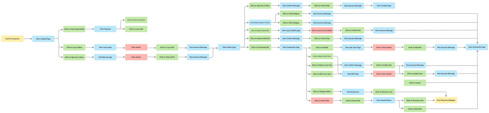
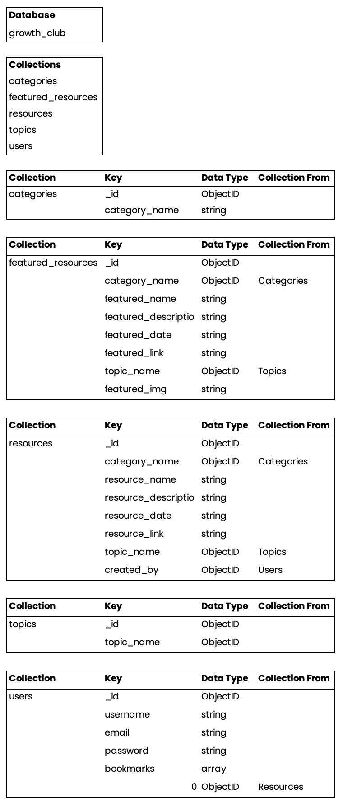

# The Growth Club

This project is part of my Code Institute Full Stack Software Development studies, specifically the Data-Centric Development module. The objective for this milestone project is to "Create a web application that allows users to view and share info on events, tools, articles and videos about UX, Software Development and Tech ", using the CRUD operations of Create, Read, Update, and Delete for info.

<a></a>
## Table of contents 
* [UX](#ux)
    * [User Persona](#user-persona)
    * [User Goals](#user-goals) 
    * [Site Owners Goals](#site-owners-goals) 
    * [User Requirements and Expectations](#user-requirements-and-expectations)
        * [Requirements](#requirements)
        * [Expectations](#expectations)
    * [User Stories](#user-stories)
    * [Design](#design)
        * [Icons](#icons)
        * [Colours](#colours)
        * [Logo](#logo)
* [Wireframes](#wireframes)
* [Features](#features)
    * [Existing Features](#existing-features)
    * [Features to be implemented](#features-to-be-implemented)
* [Technologies used](#technologies-used)
    * [Languages](#languages)
    * [Libraries](#libraries)
    * [Tools](#tools)
    * [Design](#design)
* [Testing](#testing)
* [Deployment](#deployment)
* [Credits](#credits)

<a name="ux"></a>
## **UX**
<a></a>
### **User Persona**
This website project will target users who are interested in viewing and sharing information about UX, Design, Software Development and Tech. The priority focus is on providing an easy to navigate and responsive website that allows users to be a part of a community with a collection of resources such as articles, tools, videos and events.

<a></a>
### **User Goals**
- View featured **resources posts per month** created by the Growth Club;
- View **resource posts** created by the Growth Club community;
- View, edit, search, delete **resource posts** created by them;
- The website has to work well on all kinds of devices like mobile phones, tablets and desktops.

<a></a>
### **Site Owners Goals**
- Be the “go-to” place for users in the UX, design, software and tech industry for resources
- To create a community for users in the UX, design, software and tech industry.

<a></a>
### **User Requirements and Expectations**
#### **Requirements**
- Easy to navigate by using the navigation menu.
- Relevant content for each category.
- Appealing visual elements.
- Easy way to find resources relevant to the user.
#### **Expectations**
- When clicking on links (resource and social media links), expect the page to open in a separate browser.
- Expect that the navigation links work properly to take the user where they intended to go.
- Expect to be able to add, edit or delete items added by the user.
- Feedback whether or not registered, logged in, logged out.

<a></a>
### **User Stories**
*Guest User*
- As a Guest User, I want to view the featured **resources posts** of the month to get a sense of the value if I sign up as a registered user and they don't have to search for it;
- As a Guest User, I want to be met with a visually appealing and easy to read layout of created items;
- As a Guest User, I want the main purpose of the site to be clear so that I immediately know what the site is intended for upon entering;
- As a Guest User, I want to be able to sign-up to create and edit my own **resource posts**;
- As a Guest User, I want to be able to get in contact via social media if I like the site or have suggestions.

*Registered User*
- As a Registered User, I want to view the featured items of the month so that I don't have to search for them;
- As a Registered User, I want to be met with a visually appealing and easy to read layout of created items;
- As a Registered User, I want the main purpose of the site to be clear so that I immediately know what the site is intended for upon entering;
- As a Registered User, I want to be able to log back into the Growth Club with my initial latest credentials;
- As a Registered User, I want to be able to create, edit and delete the **resource posts** I have added;
- As a Registered User, I want to be able to view **resource posts** added by other members of the community;
- As a Registered User, I would like to be able to search the site so that I can easily find resources that I am looking for;
- As a Registered User, I want to be able to bookmark resources I find interesting;
- As a Registered User, I want to be able to change my password on my profile;
- As a Registered User, I want to be able to delete my account and profile;
- As a Registered User, I want to be able to log out of my account;
- As a Registered User, I want to be able to get in contact via social media if I like the site or have suggestions.

*Admin User*
- As an Admin User, I would like the ability to **log in to an admin account** so that I can **create and edit featured resources posts** for each month;
- As an Admin User, I want to be able to view all **resource posts** added by other members of the community;
- As an Admin User, I would like the ability to ** to create resource posts** without restrictions;
- As an Admin User, I would like the ability to **edit any resource posts** so that I can **maintain the site to stay updated**;
- As an Admin User, I would like the ability to ** to delete any resource posts** so that I can **remove outdated information**;
- As an Admin User, I would like to be able to search the site so that I can easily find resources that I am looking for;
- As an Admin User, I want to be able to log out of my account;
- As an Admin User, I want to be able to change my password on my profile;
- As an Admin User, I want to be able to bookmark resources.

<a></a>
### **User flow**
In the planning phase, I created a User flow to determine the main paths the user might take on the web app. 


### Log In & Sign Up Flow
In the planning phase, I created a Login and Sign up/Register flow to determine the main paths the user might take on the web app to manage their status on the website. The success and failure messages differ slightly on the deployed app as the copy was changed during testing with users to be more clear 

___
<br>

## UI Design
### Font
- I used Google Fonts to explore the various options.
- The project has a main font of Roboto as it is easy to read and modern
- “Sans-Serif” is used as the default backup font in cases where these fonts have difficulty loading.

### Colour Scheme
- The colour scheme is based on creating an environment with energy, excitement and warmth.
- I used Coolors to map out my colour scheme.
- The logo was created with Off-Black and underlined with Orange
- The navbar is created with cream
- The call to action buttons black
- All colours were checked with WebAIM [https://webaim.org/resources/contrastchecker/](https://webaim.org/resources/contrastchecker/) to check the accessibility of the colours and present a pass
[image]

### Icons
I used icons from Materialized and Font Awesome library. The icons that were used were are all .... themed or used to give meaning to a certain section.

## Wireframes
I have used Balsamic to create low-fidelity wireframes and used Figma to create medium-fidelity wireframes. First I created a basic wireframe for mobile, for tablet and desktop. The website will be easy to navigate by using the navigation bar or by scrolling down the page. I have included a scroll-up button for user convenience.There is a mobile-first focus and therefore I wanted to keep in mind first what will work on mobile.
### Wireframe images:
**Sketches**
[image]
**Low Fidelity**
[image]
**Medium Fidelity**
[image]

## Data Structure
A database structure was designed to be specifically suited for The Growth Club. It was important to make sure the nesting relationships between the collections and the keys worked logically. The database was created as a usable non-relational database where data is stored in a consistent and well-organised manner. To maintain a database configuration in a single location where it can be changed easily, ObjectId's are used in several collections to ensure key values are more accurate by using the ObjectId's rather than strings.

[MongoDB](https://www.mongodb.com/) is utilised to store data for The Growth Club. It is a non-relational database-backed Flask web application that allows users to easily create, locate, display, edit and delete data records on the Growth Club web app.

The data structure outline:


### Collections

- **Categories collection**
    - This collection holds the category_name key which is a string datatype. 
    - This field data is passed to other collections by utilising the ObjectID rather than the string above.

- **Featured Resources collection**
    - This collection holds several keys for the featured section on the landing page which is only editable by the admin user.
    - The data keys include the category name, resource name, description, date of an event, link to the resource, topic name and a featured image. 
    - All the above keys are strings except for the category name and topic name as the ObjectID's are used from the categories and topics collections respectively. 

- **Resources collection**
    - This collection holds several keys for the resource page where the user can view all the resources in the database.
    - The data keys include the category name, resource name, description, date of an event, link to the resource, topic name and a created by. 
    - All the above keys are strings except for the category name, topic name and created by as the ObjectID's are used from the categories, topics and users collections respectively. 
    - The data from this collection is also used on the user's profile if they have bookmarked a particular resource

- **Topics collection**
    - This collection holds the topic_name key which is a string datatype. 
    - This field data is passed to other collections by utilising the ObjectID rather than the string above.

- **Users collection**
    - This collection holds several keys about the user which is provided by the user on the register page and used again on the log in page.
    - The data keys include the username, email, password and bookmarks. 
    - All the above keys are strings except for the bookmarks key as this is an array datatype. 
    - The bookmarks key is created if the user has bookmarked a resource on the resources page. The resource ObjectID is then used as the value for the item in the array.
___
<br>

## Features
- There is a mobile-first focus and therefore I wanted to keep in mind first what will work on mobile.

### Elements on every page
#### Header

1. Logo

- Allows the user to easily recognise the brand of “Growth Club”. If the user clicks on the logo, it will return the users to the “Home” section as they would expect..

2. Navbar
- Navigation Bar - Allows the user to easily navigate the website's sections and find what they are looking for with ease and speed.
- The navigation bar features the Growth Club logo in the top left corner.
- For visitors to the site who are not logged in, list items links are available for them to use.
    - Home
    - Log in
    - Sign Up
- For users who are logged in, the list items are as follows:
    - Home
    - Resources
    - Profile (this option is a dropdown menu)
        - Log out
- Python determines if the user is logged in or not by checking if 'user' in session and passes this data to Jinja to display the correct navbar for the user.
- The navbar is collapsed into a burger icon on small screens

3. Floating to top button:
- A floating button appears on the lower right of the screen when the user starts to scroll downwards. Clicking this moves the view back up to the top of the page. I added this feature because some pages can be quite long and the navbar is not fixed to the top of the page.

4. Footer
- The footer features:
    - A brief description of the purpose and mission of the site.
    - A list of useful links users might need when viewing the footer.
    - Copyright information.
    - Links to social media for Admin -Social Icons - Allows the user to access the social platforms that the designer & creator of the website use.

### Landing Page

### Favourite Section

### Resources Page

### Log in Page
- The login page features a simple **form** where the user can enter either their username or their email address and their password.

### Sign Up Page
- The sign-up page features a simple form, where the user can input a username, email address and password. The form was kept deliberately simple so that signup has minimum barriers.

### Add Resource Page
- The add resources page features a simple form, where the user can input the basic required information. The form was kept deliberately simple so that signup has minimum barriers.

### Edit Resource Page
- The edit resources page features a simple form, where the user can edit only a resource added by them. The form was kept deliberately simple so that signup has minimum barriers.

### 404 Page

- The custom 404 Page contains ..., and two buttons to return the user to the Growth Club Home page or Resources page.

### Features to be implemented
- Have a 'forget password' functionality.
- Have a more extensive user profile with, profile image, preferences and email to which you can send updates, newsletters etc
- Events in the form of a calendar

## Technologies Used

## Testing

## Deployment
This project was developed using the Gitpod IDE, committed to git and pushed to GitHub using the built-in function within Gitpod. After writing the code, committing and pushing it to GitHub. I've deployed this project to Heroku and used "git push Heroku master" to make sure my pushes to GitHub were also made to Heroku.

This project can be run locally by following the following steps: ( I used Gitpod for development, so the following steps will be specific to Gitpod. You will need to adjust them depending on your IDE

The following **must be installed** on your IDE:
- [PIP](https://pip.pypa.io/en/stable/installing/)
- [Python 3](https://www.python.org/downloads/)

You have to create an account with MongoDB.
- You can see [here](https://docs.atlas.mongodb.com/) how to set up your MongoDB Atlas account.

**To clone the project:**
- From the application's repository, click the "code" button and download the zip of the repository. Alternatively, you can clone the repository using the following line in your terminal: git clone https://github.com/byIlsa/story-chain.git
- Access the folder in your terminal window and install the application's required modules using the following command: pip3 install -r requirements.txt
- Sign-in or sign-up to MongoDB and create a new cluster
- Within the Sandbox, click the collections button and after click Create Database (Add My Own Data) called story_chain
- Set up the following collections: users, stories and chains. Click [here](https://github.com/byIlsa/story-chain#database-structure) to see the exact Database Structure
- Under the Security menu on the left, select Database Access.
- Add a new database user, and keep the credentials secure
- Within the Network Access option, add IP Address 0.0.0.0
- In your IDE, create a file containing your environmental variables called [env.py](http://env.py/) at the root level of the application. It will need to contain the following lines and variables: import os
    ```
    - os.environ["PORT"] = "5000"
    - os.environ["SECRET_KEY"] = "YOUR_SECRET_KEY"
    - os.environ["DEBUG"] = "True"
    - os.environ["MONGO_URI"] = "YOUR_MONGODB_URI"
    - os.environ["MONGO_DBNAME"]= "DATABASE_NAME"
- Please note that you will need to update the SECRET_KEY with your secret key, as well as the MONGO_URI and MONGO_DBNAME variables with those provided by MongoDB. Tip for your SECRET_KEY, you can use a Password Generator to have a secure secret key. I recommend a length of 24 characters and exclude symbols. To find your MONGO_URI, go to your clusters and click on connect. Choose connect your application and copy the link provided. Don't forget to update the necessary fields like password and database name. If you plan on pushing this application to a public repository, ensure that [env.py](http://env.py/) is added to your .gitignore file.
- The application can now be run locally. In your terminal, type the following command python3 [app.py](http://app.py/).

**To deploy your project on Heroku, use the following steps:**

- Login to your Heroku account and create a new app. Choose your region.
- Ensure the Procfile and requirements.txt files exist are present and up-to-date in your local repository.
**Requirements:**

`pip3 freeze --local > requirements.txt`

**Procfile:**

`echo web: python app.py > Procfile`

- The Procfile should contain the following line:

`web: python app.py`

**Final steps:**
- Scroll down to the "deployment method"-section. Choose "Github" for automatic deployment.
- From the inputs below, make sure your GitHub user is selected, and then enter the name for your repo. Click "search". When it finds the repo, click the "connect" button.
- Scroll back up and click "settings".
    - Scroll down and click "Reveal config vars".
- Set up the same variables as in your [env.py](http://env.py/) (IP, PORT, SECRET_KEY, MONGO_URI and MONGODB_NAME): !You shouldn't set the DEBUG variable is under config vars, only in your [env.py](http://env.py/) to prevent DEBUG from being active on the live website.
    - PORT = 5000 SECRET_KEY = YOUR_SECRET_KEY MONGO_URI = YOUR_MONGODB_URI MONGO_DBNAME = DATABASE_NAME
- Scroll back up and click "Deploy". Scroll down and click "Enable automatic deployment".
- click "Deploy branch". Heroku will now start building the app. When the build is complete, click "view app" to open it.
- To commit your changes to the branch, use git push to push your changes.

## Credits

### Content
- The copy and text for this website was created by Franciska Du Toit

### Media
- Images used are from Undraw

### Code
Acknowledgements